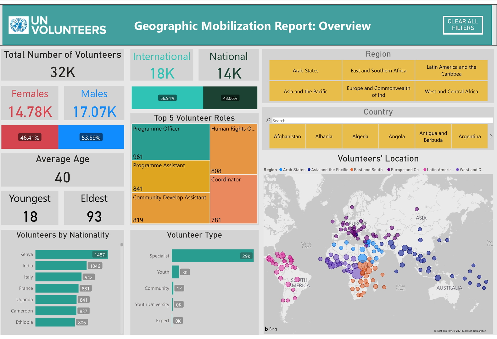

# UN-Volunteer-Data-Analysis-using-Power-BI
Every year, roughly 3000 selfless United Nations Volunteers offer their time and expertise to make the world a better place.

This simple interactive dashboard was created to serve as an easily accessible platform to provide key insights regarding the geographic mobilization and demographics of the volunteers. Built with intuitive filters, users can look into specific groups of volunteers to better understand the operations the volunteers are involved in during their work with UN.

Content of each page is as follows:

Page 1: Overview: Snapshot of all essential numbers and information that are commonly asked for

Page 2: Demographic breakdown: Trends and key information of key demographic groups

Page 3: Organization breakdown: Specific look into UN subsidiaries to track areas of operations

**-Deepansh Arora**

